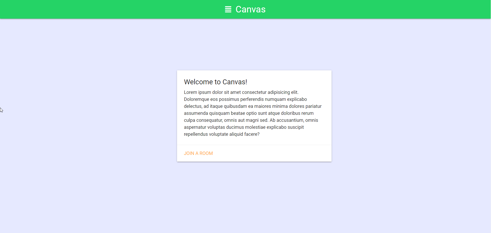
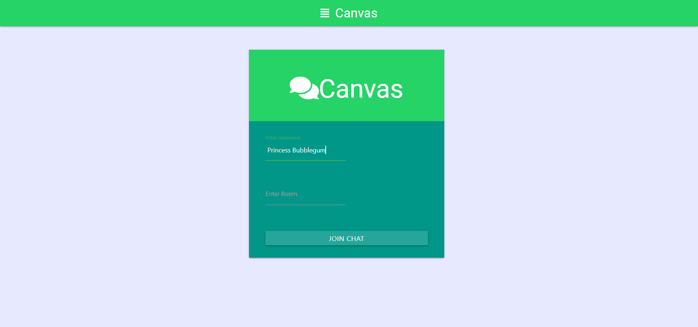
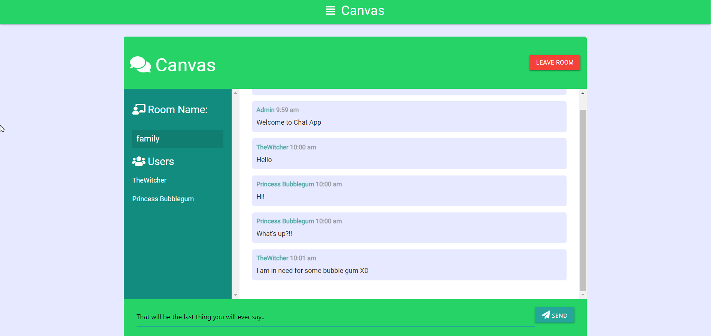

# Sockets Text Template
The public folder contains the html css and js files. I have used maretialize theme for this application. The template uses sockets to send and recieve messages.
## Development server

Run `node server` or `nodemon` for a dev server. Navigate to `http://localhost:3000/`.
## Build

## ScreenShots
## Home

## Login Page

## Chat UI

